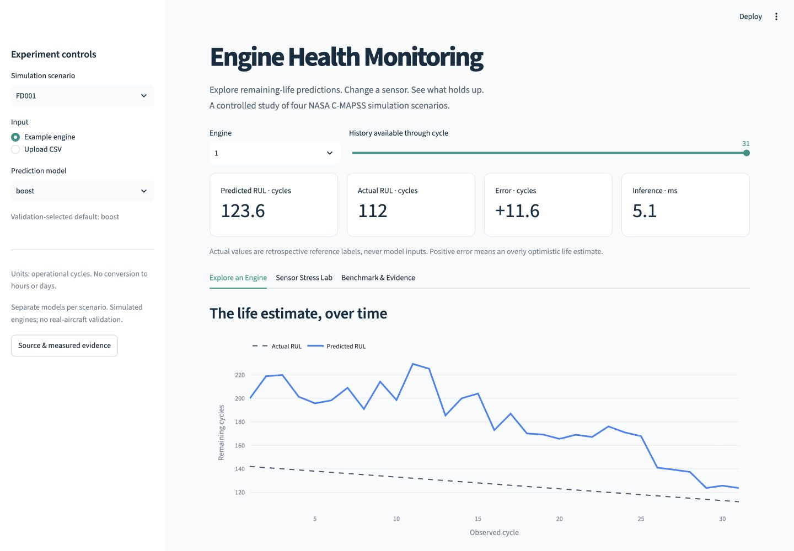
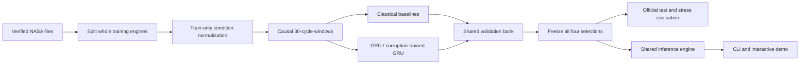

# Engine Health Monitoring

**How much useful life remains when a sensor becomes unreliable?**

From-scratch remaining-life prediction on four NASA C-MAPSS subsets, with controlled sensor failures, engine-level evaluation and an interactive experiment panel.



[Measured results](docs/results/STUDY_V1.md) · [Release v0.1.0](https://github.com/numann44/engine-health-monitoring/releases/tag/v0.1.0) · [Experiment protocol](docs/experiment-protocol.md) · [Data audit](docs/data.md) · [Architecture](docs/architecture.md) · [Reproduce](docs/reproduction.md)


> **Measured research release.** All 52 declared fits and the fixed official-test evaluation are complete. Publication and hosted checks are tracked in [the delivery ledger](docs/DELIVERY.md). The hypothesis is reported separately for each subset; no test-driven retuning follows this release.

## What it does

- Predicts **remaining operational cycles**, using the previous 30 cycles of sensor measurements.
- Compares Ridge, gradient boosting and two-layer GRUs trained from random initialization.
- Tests missing sensors, noise, stuck readings and bias using identical perturbations for every model.
- Separates model selection from official test outcomes and records reproducible checkpoint identities.

## Research question

Can a GRU trained with measurement corruptions reduce mean mild-stress RMSE by **at least 10%**, while increasing clean RMSE by **no more than 5%**, compared with the same architecture trained on clean measurements?

The criterion is evaluated separately on FD001–FD004. Negative outcomes are retained. Three seeds are averaged per neural family; the strongest individual seed is never selected using test labels.

## Measured results

| Scenario | Validation-selected default | Clean RMSE [95% CI] | MAE | >20-cycle overestimates |
|---|---|---:|---:|---:|
| FD001 | boost | 23.33 [19.09, 27.52] | 16.39 | 27/100 |
| FD002 | gru | 26.53 [23.29, 29.82] | 17.74 | 36/259 |
| FD003 | robust_gru | 29.03 [22.81, 34.94] | 19.00 | 27/100 |
| FD004 | robust_gru | 28.32 [25.07, 31.53] | 19.84 | 57/248 |

| Scenario | Mild RMSE reduction | Clean RMSE increase | Point criterion |
|---|---:|---:|---|
| FD001 | 4.7% | -3.2% | Not met |
| FD002 | 5.1% | -4.3% | Not met |
| FD003 | -1.5% | 0.5% | Not met |
| FD004 | -4.8% | 8.4% | Not met |

Intervals resample engines 2,000 times. The robustness criterion compares the two three-seed GRU ensembles, even where the default model is classical. Negative clean increases indicate improved clean RMSE. These are uncapped-RUL results, not directly comparable with capped-label leaderboards.

[Full measured report](docs/results/STUDY_V1.md) · [Failure analysis](docs/results/FAILURE_ANALYSIS.md) · [Machine-readable results](docs/results/study-v1.json)

## Interactive demo

Three views share the same inference engine: **Explore an Engine**, **Sensor Stress Lab**, and **Benchmark & Evidence**. Upload the documented CSV format or use verified NASA examples; export predictions, model identities and plots. Run `streamlit run app/streamlit_app.py` locally. The public URL will be added after hosted behavior is verified.

[CSV contract](docs/csv-format.md) · [Deployment checks](docs/deployment.md)

## Architecture



## Quick start

```bash
python3.12 -m venv .venv
source .venv/bin/activate
pip install -r requirements.lock
pip install --no-deps -e .
engine-health download
engine-health audit
engine-health prepare
OMP_NUM_THREADS=1 MKL_NUM_THREADS=1 python scripts/smoke.py
```

See [the reproduction guide](docs/reproduction.md) before running the full study. Data, outputs and model checkpoints are excluded from Git.

## Data and evaluation

The archive contains **709 training and 707 test engines** across four simulation scenarios. FD004 contains 249 training / 248 test engines; the source README reverses those counts. Whole training engines are split 80/20 before windowing. Neither future measurements nor engine end-of-life are input features.

RMSE, MAE, excessive overestimation, engine-bootstrap intervals, per-seed variation and warm CPU latency are reported. Corrupted copies are paired conditions, not additional independent engines.

## Repository guide

| Location | Purpose |
|---|---|
| `src/engine_health` | Data, training, evaluation and common inference |
| `configs` / `protocols` | Fixed budgets, splits and declared experiment |
| `app` | Streamlit experiment panel |
| `tests` | Causality, resume, identity and inference checks |
| `docs` | Method, evidence, limitations and reproduction |

## Failure analysis

The predeclared ≥10% mild-stress improvement target was **not met on any subset**. Augmentation improved mild-stress RMSE by 4.7% and 5.1% on FD001/FD002, but worsened it on FD003/FD004. FD004 clean RMSE increased 8.4%. Defaults remain the validation-selected methods, even where another method later scores better on test.

[Annotated failure trajectories](docs/results/FAILURE_ANALYSIS.md) · [Paired hypothesis intervals](docs/results/HYPOTHESIS_UNCERTAINTY.md) · [CV descriptions](docs/cv-project.md) · [Interview notes](docs/interview-notes.md)

## Limitations

This is a **simulation-data research project**. It is not a certified maintenance system or evidence of reliability on real aircraft. Each subset has separate fitted models. Measurement corruption is not the same as physical engine damage. Remaining cycles are not a fault probability or a universal health percentage.

## Citation and licensing

Code: [MIT](LICENSE). Dataset: separate NASA source terms; the source catalog does not specify a license identifier. Raw data are downloaded from NASA, never relicensed as project code.

A. Saxena and K. Goebel (2008), *Turbofan Engine Degradation Simulation Data Set*, NASA Ames Prognostics Data Repository. See [data provenance](docs/data.md) and [CITATION.cff](CITATION.cff).
