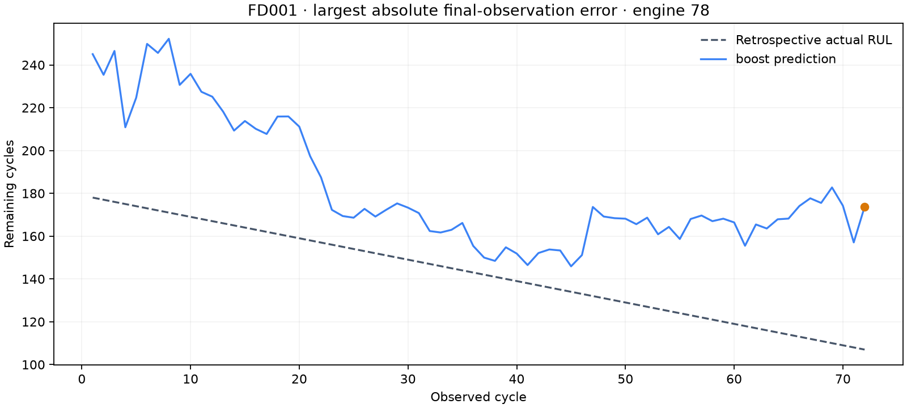
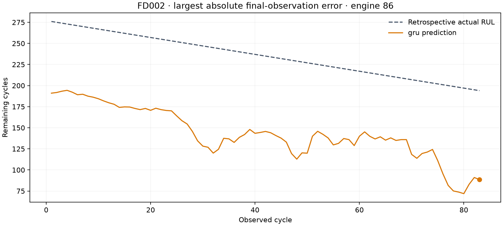
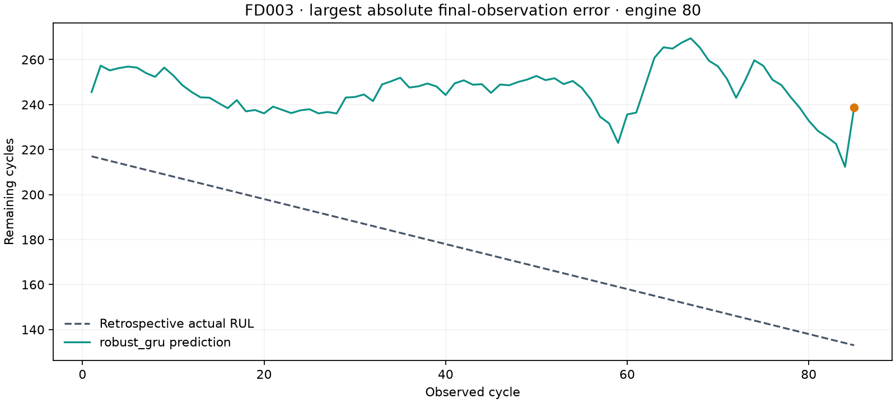
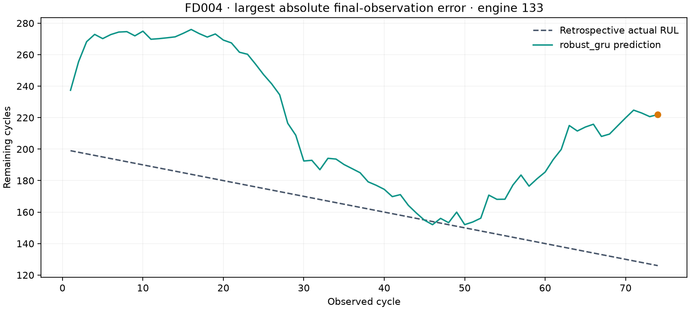

# Failure analysis

Examples are selected by a deterministic maximum-absolute-error rule. No further experiments are opened by these outcomes.

## FD001 · engine 78

The validation-selected boost predicts **173.7 cycles**, while the reference is **107**: a **+66.7-cycle** error. This is the largest absolute error among 100 final-observation predictions. The optimistic estimate could delay a maintenance decision. These are implications of the signed error, not observed real-world outcomes.

Every trajectory point is recomputed from its available past only. Earlier points are descriptive retrospective examples; the primary test metric uses the last point. The failure was selected after evaluation for explanation, never to change weights or hyperparameters. A sensor plot alone cannot establish the physical cause of an error.

## FD002 · engine 86

The validation-selected gru predicts **88.6 cycles**, while the reference is **194**: a **-105.4-cycle** error. This is the largest absolute error among 259 final-observation predictions. The pessimistic estimate could cause premature maintenance. These are implications of the signed error, not observed real-world outcomes.

Every trajectory point is recomputed from its available past only. Earlier points are descriptive retrospective examples; the primary test metric uses the last point. The failure was selected after evaluation for explanation, never to change weights or hyperparameters. A sensor plot alone cannot establish the physical cause of an error.

## FD003 · engine 80

The validation-selected robust_gru predicts **238.7 cycles**, while the reference is **133**: a **+105.7-cycle** error. This is the largest absolute error among 100 final-observation predictions. The optimistic estimate could delay a maintenance decision. These are implications of the signed error, not observed real-world outcomes.

Every trajectory point is recomputed from its available past only. Earlier points are descriptive retrospective examples; the primary test metric uses the last point. The failure was selected after evaluation for explanation, never to change weights or hyperparameters. A sensor plot alone cannot establish the physical cause of an error.

## FD004 · engine 133

The validation-selected robust_gru predicts **221.9 cycles**, while the reference is **126**: a **+95.9-cycle** error. This is the largest absolute error among 248 final-observation predictions. The optimistic estimate could delay a maintenance decision. These are implications of the signed error, not observed real-world outcomes.

Every trajectory point is recomputed from its available past only. Earlier points are descriptive retrospective examples; the primary test metric uses the last point. The failure was selected after evaluation for explanation, never to change weights or hyperparameters. A sensor plot alone cannot establish the physical cause of an error.
