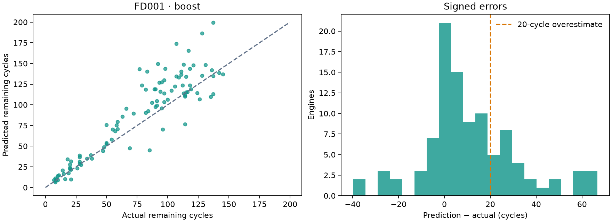
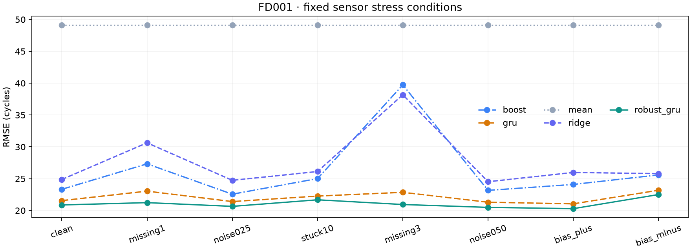
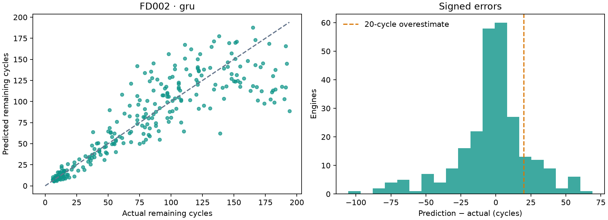
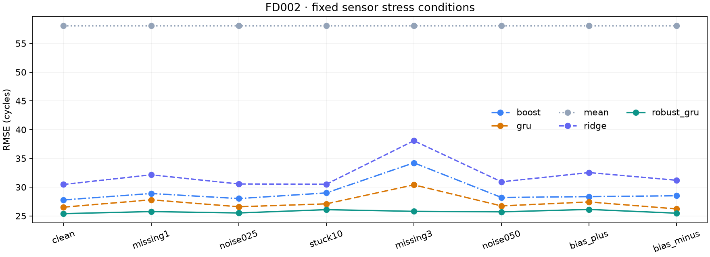
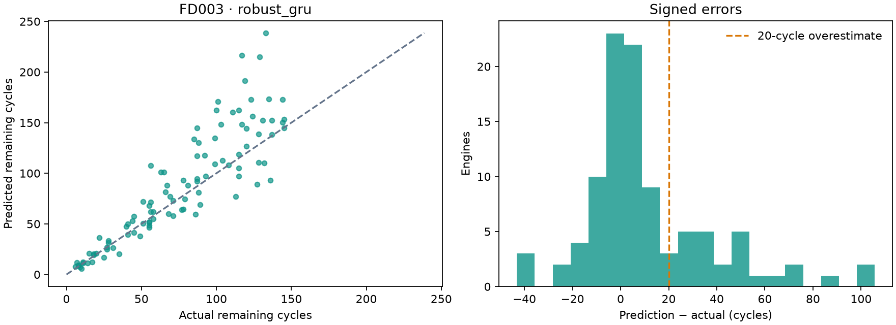
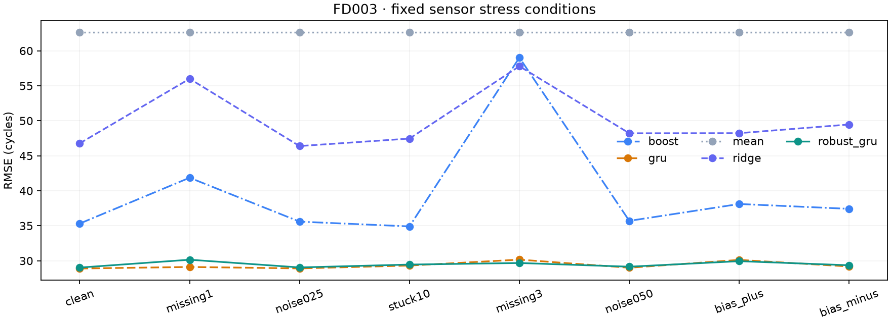
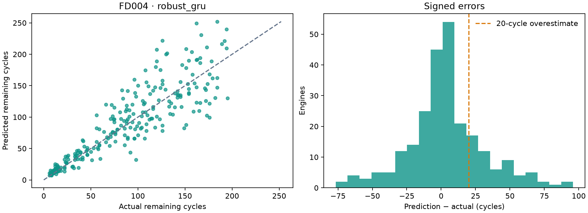
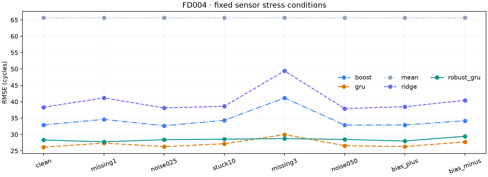

# Controlled sensor robustness study

All four subset selections were frozen before official test evaluation. Each test engine contributes one final-observation prediction. Targets are uncapped RUL cycles.

A different model is fitted per subset. This is not evidence of one model generalizing across all engine regimes or of reliability on real engines.

| Subset | Default (validation-selected) | Clean RMSE | Clean MAE | >20-cycle overestimates | Engines |
|---|---|---:|---:|---:|---:|
| FD001 | boost | 23.33 | 16.39 | 27 | 100 |
| FD002 | gru | 26.53 | 17.74 | 36 | 259 |
| FD003 | robust_gru | 29.03 | 19.00 | 27 | 100 |
| FD004 | robust_gru | 28.32 | 19.84 | 57 | 248 |

## Predeclared hypothesis

At least 10% lower mean mild-stress RMSE than the standard GRU, with at most 5% higher clean RMSE. This is a point-estimate criterion; intervals are in the machine-readable report.

| Subset | Mild RMSE reduction | Clean RMSE increase | Point target |
|---|---:|---:|---|
| FD001 | 4.7% | -3.2% | Not met |
| FD002 | 5.1% | -4.3% | Not met |
| FD003 | -1.5% | 0.5% | Not met |
| FD004 | -4.8% | 8.4% | Not met |

## FD001

Best, median and worst absolute-error engines, selected by a declared rule after evaluation. These examples are descriptive and never used for model selection.

| Example | Engine | Actual RUL | Predicted RUL | Signed error |
|---|---:|---:|---:|---:|
| Best | 26 | 119 | 119.01 | +0.01 |
| Median | 40 | 28 | 38.95 | +10.95 |
| Worst | 78 | 107 | 173.74 | +66.74 |

| Model | Clean RMSE (95% engine-bootstrap interval) | CPU median / p95 ms |
|---|---|---|
| boost | 23.33 [19.09, 27.52] | 0.57 / 0.62 |
| gru | 21.56 [17.73, 25.37] | 1.11 / 1.16 |
| mean | 49.10 [43.38, 54.96] | 0.03 / 0.03 |
| ridge | 24.88 [21.50, 28.41] | 0.11 / 0.11 |
| robust_gru | 20.87 [17.09, 24.69] | 0.93 / 1.09 |

## FD002

Best, median and worst absolute-error engines, selected by a declared rule after evaluation. These examples are descriptive and never used for model selection.

| Example | Engine | Actual RUL | Predicted RUL | Signed error |
|---|---:|---:|---:|---:|
| Best | 186 | 10 | 10.02 | +0.02 |
| Median | 96 | 49 | 38.41 | -10.59 |
| Worst | 86 | 194 | 88.56 | -105.44 |

| Model | Clean RMSE (95% engine-bootstrap interval) | CPU median / p95 ms |
|---|---|---|
| boost | 27.78 [24.85, 30.72] | 0.68 / 0.74 |
| gru | 26.53 [23.29, 29.82] | 1.25 / 1.33 |
| mean | 58.05 [54.64, 61.30] | 0.03 / 0.03 |
| ridge | 30.48 [27.80, 33.29] | 0.13 / 0.14 |
| robust_gru | 25.40 [22.49, 28.38] | 1.23 / 1.29 |

## FD003

Best, median and worst absolute-error engines, selected by a declared rule after evaluation. These examples are descriptive and never used for model selection.

| Example | Engine | Actual RUL | Predicted RUL | Signed error |
|---|---:|---:|---:|---:|
| Best | 15 | 108 | 107.90 | -0.10 |
| Median | 12 | 115 | 104.95 | -10.05 |
| Worst | 80 | 133 | 238.67 | +105.67 |

| Model | Clean RMSE (95% engine-bootstrap interval) | CPU median / p95 ms |
|---|---|---|
| boost | 35.32 [26.37, 44.26] | 0.61 / 0.65 |
| gru | 28.90 [22.53, 34.98] | 1.20 / 1.29 |
| mean | 62.61 [55.94, 68.98] | 0.03 / 0.03 |
| ridge | 46.78 [37.03, 57.21] | 0.12 / 0.13 |
| robust_gru | 29.03 [22.81, 34.94] | 1.13 / 1.15 |

## FD004

Best, median and worst absolute-error engines, selected by a declared rule after evaluation. These examples are descriptive and never used for model selection.

| Example | Engine | Actual RUL | Predicted RUL | Signed error |
|---|---:|---:|---:|---:|
| Best | 216 | 17 | 17.06 | +0.06 |
| Median | 188 | 135 | 122.30 | -12.70 |
| Worst | 133 | 126 | 221.91 | +95.91 |

| Model | Clean RMSE (95% engine-bootstrap interval) | CPU median / p95 ms |
|---|---|---|
| boost | 32.93 [29.52, 36.55] | 0.59 / 0.68 |
| gru | 26.13 [23.11, 29.13] | 1.19 / 1.26 |
| mean | 65.63 [61.36, 69.74] | 0.03 / 0.03 |
| ridge | 38.33 [35.12, 41.52] | 0.13 / 0.15 |
| robust_gru | 28.32 [25.07, 31.53] | 1.62 / 1.79 |

## Limits

Uncapped targets and motor-grouped validation differ from some published benchmark protocols; numbers are not leaderboard claims. Four training-life fractions form validation endpoints and need not match the distribution of official test stopping points. Sensor perturbations simulate measurement problems, not physical engine damage. No test-driven retuning is part of this release.

Intervals resample engines (2,000 draws), not correlated stress copies. Latency is warm, single-engine CPU inference, 30 trials, without concurrent model training. See the JSON for every condition, individual GRU members and paired RMSE intervals.

## Numerical diagnostics

Ridge fitting emitted ill-conditioned-matrix warnings in the FD002 and FD004 candidate groups. All recorded predictions are finite; the predeclared candidates were retained and no post-test numerical or hyperparameter change was made. None of the four validation-selected defaults is Ridge.

[Descriptive paired intervals for the hypothesis](HYPOTHESIS_UNCERTAINTY.md) · [Annotated failure trajectories](FAILURE_ANALYSIS.md)
